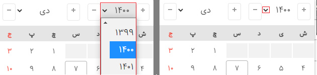

## V1.0.0

Stable 1.0.0 release with a rebuilt project structure.

- Migrated the source from JavaScript to TypeScript and added internal types for options, dates, times, and the public API.
- Replaced the old webpack build with Vite, TypeScript, Babel, and refreshed ES5/minified files in `dist`.
- Added automated tests with Vitest and jsdom for the public API, date conversion, value validation, min/max handling, and custom separators.
- Reworked the Persian and English documentation with installation, quick start, public API, options, attributes, events, value formats, and development guides.
- Added `targetValueInput` support for writing converted values to a target input.
- Added `targetValueType: "gregorian"` for writing Gregorian values to the target input.
- Added `minuteIncrement` and `hourIncrement` to control time dropdown steps.
- Added `data-jdp-has-second` for per-input seconds dropdown control.
- Added `weekDay` to `dayRendering`.
- Added `position: "left" | "right" | "center"` for datepicker placement.
- Added cleaner compatible names: `JalaliDatePicker`, `useDropdownYears`, and `isHoliday`, while keeping legacy aliases.
- Fixed date boundary handling by comparing the full year/month/day value instead of partial date fields.
- Fixed value string validation for regex-special separators such as `+`.
- Fixed `zIndex` updates after calling `updateOptions`.
- Fixed `targetValueInput` support when an `HTMLInputElement` is passed directly.
- Fixed scroll listener cleanup when showing the datepicker on different inputs.
- Fixed several UI, modal/bootstrap, weekday, event, and demo issues.

## V0.9.12

Added the ability to show always Select Button showSelectTimeBtnAlways

## V0.9.11

Added the ability to close the datepicker with ESC, thanks to @mostafa793

## V0.9.7

Bug Fix [issue128](https://github.com/majidh1/JalaliDatePicker/issues/128)

## V0.9.6

Solving the problem of not being able to select option 00 in hours, minutes and seconds

## V0.9.5

add overflowSpace config

# V0.9.4

added new Event Listener

# V0.9.3

added new config => hideAfterChange
fixed https://github.com/majidh1/JalaliDatePicker/issues/52

# V0.9.1

minor reform

# V0.9.0

by default, initTime uses instant time.

Whether the time or date is specified or not, the data-jdp-only-date and data-jdp-only-time properties function as intended. As a result, you can configure the system such that it doesn't always utilise certain properties.

Settings now include minTime and maxTime.

Shout out to [@HirbodBehnam](https://github.com/HirbodBehnam), for making a new setting for PersianDigits.

# V0.8.6
1. improving mobile display by making _UI / UX_ standard

# V0.8.0

1. improved mobile display

2. Including a runtime setting change feature

# V 0.7.0

1. the inclusion of a time selection option

2. the ability to set today's date as a default

3. displaying simply the `date` or the `time`

- Added settings: `today`, `initTime`, `hasSecond`, `time`, `date`, `separatorChars`

# V0.6.0
1. New configs, distance from `top` & `bottom`

- `topSpace`: INT

- `bottomSpace`: INT

> Also this number can be positive or negative

2. Added a new `dayRendering` method to manage days

# V0.5.2

1. Hide container

# V0.5.1
1. the days altered the verification process

# V0.5.0

1. Fix V0.4.9

# V0.4.9

1. Show the days of the `previous` month and the `future` in the current month

2. Show `inactive` days

3. Improve UI / UX

# V0.4.5

1. Fix the `position` calculation bug

# V0.4.4

1. Fix the bug of the multiple use of `startWatch`

# V0.4.3

1. Change the increase and decrease icon's size and placement.

# V0.4.2

- the rendering in dayless mode be modified

- Mobile device automatic read-only mode Improved

# V0.4.0

1. Change year fixed

2. New feature, parametric dropdown year (#8, #10)

# V0.3.1
# V0.2.9
# V0.2.7
# V0.2.5
# V0.2.4
# V0.2.1
# V0.1.9
# V0.1.8
# V0.1.7
# V0.1.6
# V0.1.4
# V0.1.3
# V0.0.5
# V0.0.4
# V0.0.3
# V0.0.1
