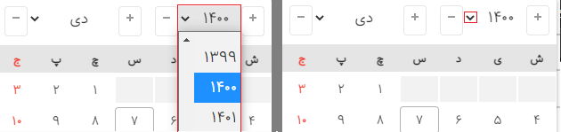

## نسخه 0.9.5

افزودن کانفیگ overflowSpace

## نسخه 0.9.4

تغییر EventListener به دلیل مشکل در zone.js

## نسخه 0.9.3

افزودن تنظیم جدید hideAfterChange برای مخفی  نشدن بعد از انتخاب تاریخ

[issue52](https://github.com/majidh1/JalaliDatePicker/issues/52)

## نسخه 0.9.1

اصلاحات جزئی

## نسخه 0.9.0

initTime به صورت پیشفرض زمان لحظه شد

اتریبیوت‌های data-jdp-only-date و data-jdp-only-time بدون در نظر گرفتن کانفیگ فعال بودن زمان یا تاریخ کار میکنند. بنابراین میتونید کانفیگ رو جوری ست کنید که لازم نباشه همیشه از این اتریبوت ها استفاده کنید

minTime و maxTime به تنظیمات اضافه شد

افزودن تنظیم جدید برای اعداد فارسی با تشکر از @HirbodBehnam عزیز persianDigits

## نسخه 0.8.6

بهبود نمایش در موبایل بر اساس استاندارهای ux/ui

## نسخه 0.8.0

بهبود نمایش در موبایل

افزودن امکان تغییر تنظیمات به صورت رانتایم

## نسخه 0.7.0

افزودن امکان انتخاب زمان

امکان تعیین روز جاری به صورت آپشن

امکان حالت نمایشی فقط تاریخ یا فقط زمان

تنظیمات جدید: today, initTime, hasSecond, time, date, separatorChars

## نسخه 0.6.0

افزودن کانفیگ جدید فاصله از بالا و پایین

topSpace: NUMBER

bottomSpace: NUMBER

این عدد میتونه منفی یا مثبت باشه

افزودن متد جدید dayRendering جهت مدیریت روز ها

## نسخه 0.5.2

مخفی شدن کانتینر

## نسخه 0.5.1

اصلاح اعتبار سنجی تاریخ

## نسخه 0.5.0

اصلاحات نسخه 0.4.9

## نسخه 0.4.9

نمایش روزهای ماه گذشته و آینده در ماه جاری

نمایش روزهای غیر فعال

اصلاحات ui/ux

## نسخه 0.4.5

اصلاح باگ محاسبه position

## نسخه 0.4.4

باگ مربوط به استفاده چندباره از startWatch

## نسخه 0.4.3

اصلاح اندازه و جایگاه آیکون افزایش و کاهش

## نسخه 0.4.2

اصلاح رندر در حالت بدون روز

اصلاح حالت فقط خواندنی اتوماتیک در موبایل

## نسخه 0.4.0

Fixed: 
Change Year

Added:
Parametric DropDown Year 
[issue10](https://github.com/majidh1/JalaliDatePicker/issues/10#issue-957473182)
[issue8](https://github.com/majidh1/JalaliDatePicker/issues/8#issue-941977061)

## نسخه 0.3.1
## نسخه 0.2.9
## نسخه 0.2.7
## نسخه 0.2.5
## نسخه 0.2.4
## نسخه 0.2.1
## نسخه 0.1.9
## نسخه 0.1.8
## نسخه 0.1.7
## نسخه 0.1.6
## نسخه 0.1.4
## نسخه 0.1.3
## نسخه 0.0.5
## نسخه 0.0.4
## نسخه 0.0.3
## نسخه 0.0.1
