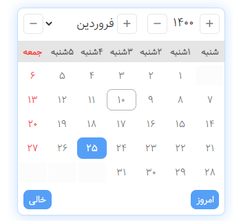
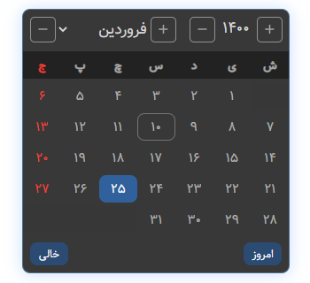
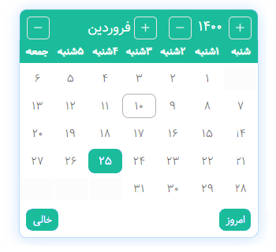
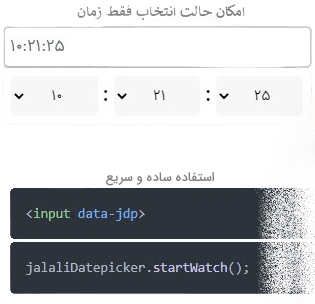
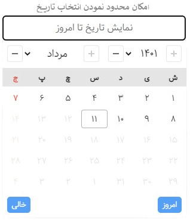

<div  align="center">

# JalaliDatePicker-
[](https://www.npmjs.com/package/@majidh1/jalalidatepicker)


[](https://raw.githubusercontent.com/majidh1/JalaliDatePicker/main/LICENSE)

</div>

<div class="img">





 
</div>

<br>

# introduction

Jalali, Shamsi, Solar hijri is the names of the calendars used as the official calendars by the people of Iran and Afghanistan.

The extracted calendars show that its months were the same length as the 30-day Yazdgardi chronology with 5 additional days, months with the same names (April (Esfand) to March (Farvardin) with a Jalali suffix), and days with numbers. However, some theories claim that new names were also mentioned for the months and days, or the length of the months, or both. Based on the relative stoppage of the sun in the constellations, another feature of the solar hijri chronology derived from Jalali, it is also known that months have a length of between 29 and 31 days. [Wikipedia](https://en.wikipedia.org/wiki/Jalali_calendar)

This calendar year begins on March 22nd, which is the first of the Farvardin, and ends on March 21st, which is the 29th of Esfand, with the exception of every four years, when the first of the Farvardin begins on March 23rd (leap year)

## Installation

#### With npm:
- JalaliDatePicker may be installed on your project using the npm command.

```sh
npm i @majidh1/jalalidatepicker
```
Then, just call it wherever you need it in your projects
```html
<!-- CSS -->
<link type="text/css" rel="stylesheet" href="jalalidatepicker.min.css"/>

<!-- js -->
<script type="text/javascript" src="jalalidatepicker.min.js"></script>
```

- OR manual installation
 ```sh
git clone https://github.com/majidh1/JalaliDatePicker.git

cd JalaliDatePicker/

mv dist/ /path/to/your/project
 ```

#### With CDN:
If you'd like, you may utilise CDN as well.
1. UNPKG:
```html
<!-- CSS -->
<link rel="stylesheet" href="https://unpkg.com/@majidh1/jalalidatepicker/dist/jalalidatepicker.min.css">

<!-- JS -->
<script type="text/javascript" src="https://unpkg.com/@majidh1/jalalidatepicker/dist/jalalidatepicker.min.js">
```

2. JSDELIVR:
```html
<!-- CSS -->
<link rel="stylesheet" href="https://cdn.jsdelivr.net/npm/jalalidatepicker@latest/dist/jalalidatepicker.min.css">

<!-- JS -->
<script type="text/javascript" src="https://cdn.jsdelivr.net/npm/jalalidatepicker@latest/dist/jalalidatepicker.min.js">
```
3. MANUAL:
```html
<!-- CSS -->
<link type="text/css" rel="stylesheet" href="/path/to/jalalidatepicker.min.css" />

<!-- JS -->
<script type="text/javascript" src="/path/to/jalalidatepicker.min.js"></script>
```

## Usage
1. Automatic detection:

- In order to initiate the calendar, add the following attribute anywhere you need to.

```html
<input data-jdp>
```
- Then, call the calendar function by using the following JavaScript code.
```js
jalaliDatepicker.startWatch();
```

2. Manual use:
- You might want to initialise the JalaliDatePicker without auto detection for any reason. All that is required is that you pass the input's id name to the following JavaScript code:
```js
jalaliDatepicker.show(document.getElementById('YOUR_INPUT_ID'));
```

## How it works?
Each time the JS file is loaded, a global object with these four methods is created.

``` js
jalaliDatepicker.startWatch(options: object);
jalaliDatepicker.show(input: document);
jalaliDatepicker.updateOptions(options: object);
jalaliDatepicker.hide();
```
1. The ```startWatch()``` method: will start the auto detection, adding JalaliDatePicker for you whenever the attribute ```data-jdp``` is present.

2. The ```show()``` method: manually display the datepicker on the input.

3. The ```hide()``` method: hide the displayed datepicker.

4. The ```updateOptions()``` method: You might use this to refresh the choices if you initially launched the datepicker.

> for `updateOptions()` and `startWatch()` method you need an object which are the following

## Options
These are the possibilities for using it in your project.

Key | Default | Description
----|---------|------------
`date` | true: bool | Show the date on DatePicker
`time` | false: bool | Show the time on DatePicker
`hasSecond` | true: bool | Can choose second when the `time` on
`initTime` | null: string | Default time
`autoShow` | true: bool | Auto show wherever `data-jdp` is present
`autoHide` | true: bool | Auto hide after click out of datepicker or input
`hideAfterChange` | true: bool | hide after choose a dateTime
`useDropDownYears` | true: bool | Can choose year with Dropdown
`separatorChars(option)` | date: `'/'` <br/> between: `' '` <br/> time: `':'` |  Separator between year, month, day <br/> Separator between date and time <br/>Separator between hour, min, sec
`persianDigits` | false: bool | replacing English letters with Persian Unicode characters
`minDate` | `null`: string | Date minimum specifier. It is the current day if it equals `today`. If not, it is equivalent to the `data-attribute-jdp-min-date`
`maxDate` | `null`: string | Date maximum specifier. It is the current day if it equals `today`. If not, it is equivalent to the `data-attribute-jdp-max-date`
`initDate` | `null`: string | If a date is not specified, it is set to be the `today` by default.
`today` | return the date that you need | It is derived by default from the system date and is equivalent to the date object to determine the current day.
`plusHtml` | `"svg"`: string | Year and month increase buttons
`minusHtml` | `"svg"`: string | Year and month decrease buttons
`container` | `document.body`: string | Where datepicker should be generating 
`selector` | `input[data-jdp]`: string | Selector of the Auto show
`zIndex` | `1000` : int | zIndex of the datepicker
`days` | ["ش", "ی", "د", "س", "چ", "پ", "ج"]: list | Days in Persian
`months` | ["فروردین", "اردیبهشت", "خرداد", "تیر", "مرداد", "شهریور", "مهر", "آبان", "آذر", "دی", "بهمن", "اسفند"]: list | Months in persian
`changeMonthRotateYear` | `false`: bool | If the month is through, move on to the following year?
`showTodayBtn` | `true`: bool | Today button
`showEmptyBtn` | `true`: bool | Clear input button
`showCloseBtn` | `dynamic` | Show the datepicker close button
`autoReadOnlyInput` | `dynamic` | Make input 
`topSpace` | `0: int` | The empty space between the top of the datepicker and the input (when the datepicker is at the bottom of the input)
`bottomSpace` | `0`: int | The empty space between the top of the datepicker and the input (when the datepicker is at the top of the input)
`bottomSpace` | `-10`: int | The empty space between the corner of the page (window) and datePicker (when the datepicker goes out of the page)
`dayRendering` | `callable`: callable | The render method of a day is the output of an object from the day setting

### Example of _`dayRendering`_:

```js
// first start watch
jalaliDatepicker.startWatch({
  dayRendering: (dayOptions,input) => {
    return {
     isHollyDay: dayOptions.month==1 && dayOptions.day<=4,
     // isValid = false, disable the days
     // className = "nowruz", add class
    }
  }
})
```


### Attributes:

- `jdp`

- `data-jdp-min-date`

- `data-jdp-max-date`

- `data-jdp-only-date`

- `data-jdp-only-time`


## [Changelog](/ChangeLog-en.md)
