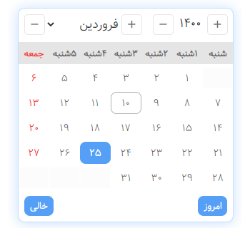
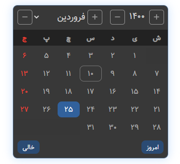
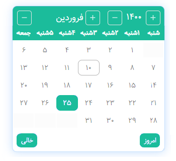
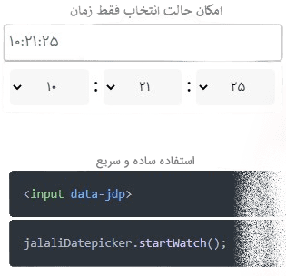
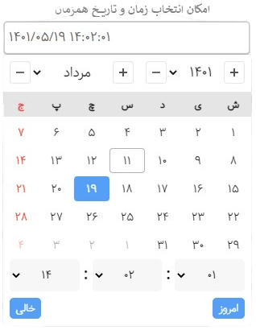

<div align="center">

# JalaliDatePicker

[](https://www.npmjs.com/package/@majidh1/jalalidatepicker)


[](https://raw.githubusercontent.com/majidh1/JalaliDatePicker/main/LICENSE)

</div>

A lightweight dependency-free Jalali/Persian datepicker for selecting dates, times, or date-time values in browser forms.

<p align="center">
 
 
 
 
 
 
</p>

## Table Of Contents

- [Installation](#installation)
- [Quick Start](#quick-start)
- [Public API](#public-api)
- [Examples](#examples)
- [Options](#options)
- [Input Attributes](#input-attributes)
- [Events](#events)
- [Value Formats](#value-formats)
- [Development](#development)

## Installation

### npm

```shell
npm i @majidh1/jalalidatepicker
```

Then include the generated CSS and JS files in your page:

```html
<link rel="stylesheet" href="jalalidatepicker.min.css">
<script src="jalalidatepicker.min.js"></script>
```

### CDN

```html
<link rel="stylesheet" href="https://unpkg.com/@majidh1/jalalidatepicker/dist/jalalidatepicker.min.css">
<script src="https://unpkg.com/@majidh1/jalalidatepicker/dist/jalalidatepicker.min.js"></script>
```

### Manual

You can also copy the ready-to-use files from `dist`:

```text
dist/jalalidatepicker.min.css
dist/jalalidatepicker.min.js
```

## Quick Start

Add the `data-jdp` attribute to an input:

```html
<input data-jdp>
```

Start the watcher after the JS file is loaded:

```html
<script>
 jalaliDatepicker.startWatch();
</script>
```

By default, every input matching `input[data-jdp]` opens the datepicker on focus.

## Public API

The JS bundle exposes a global `jalaliDatepicker` object:

```js
jalaliDatepicker.startWatch(options);
jalaliDatepicker.show(input);
jalaliDatepicker.hide();
jalaliDatepicker.updateOptions(options);
```

| Method | Description |
| --- | --- |
| `startWatch(options)` | Enables automatic datepicker behavior for inputs matching `selector` |
| `show(input)` | Manually shows the datepicker for an `HTMLInputElement` |
| `hide()` | Hides the current datepicker |
| `updateOptions(options)` | Updates options after `startWatch` |

## Examples

### Date Picker

```html
<input data-jdp>

<script>
 jalaliDatepicker.startWatch();
</script>
```

### Date And Time Picker

```html
<input data-jdp>

<script>
 jalaliDatepicker.startWatch({
  date: true,
  time: true,
  hasSecond: true
 });
</script>
```

### Time Only

```html
<input data-jdp data-jdp-only-time>

<script>
 jalaliDatepicker.startWatch({
  time: true
 });
</script>
```

### Date Boundaries

```html
<input data-jdp>

<script>
 jalaliDatepicker.startWatch({
  minDate: {
   year: 1403,
   month: 1,
   day: 10
  },
  maxDate: {
   year: 1403,
   month: 12,
   day: 29
  }
 });
</script>
```

### Boundaries From Attributes

```html
<input
 data-jdp
 data-jdp-min-date="1403/01/10"
 data-jdp-max-date="1403/12/29"
>

<script>
 jalaliDatepicker.startWatch({
  minDate: "attr",
  maxDate: "attr"
 });
</script>
```

### Write Gregorian Value To Another Input

```html
<input data-jdp>
<input id="gregorian-date">

<script>
 jalaliDatepicker.startWatch({
  targetValueInput: "#gregorian-date",
  targetValueType: "gregorian"
 });
</script>
```

If the user selects `1403/01/01`, the target input receives `2024-03-20`.

### Range Selection

```html
<input data-jdp>

<script>
 jalaliDatepicker.startWatch({
  mode: "range",
  rangeSeparator: " - "
 });
</script>
```

Selecting `1403/01/01` and `1403/01/05` writes `1403/01/01 - 1403/01/05`.
Range and multiple modes write date-only values.

### Multiple Date Selection

```html
<input data-jdp>

<script>
 jalaliDatepicker.startWatch({
  mode: "multiple",
  multipleSeparator: ", "
 });
</script>
```

Selected dates are sorted and written as a separated list, for example `1403/01/01, 1403/01/05`.
Range and multiple modes write date-only values.

### Per-Input Selection Mode

```html
<input data-jdp data-jdp-mode="range">
<input data-jdp data-jdp-mode="multiple">

<script>
 jalaliDatepicker.startWatch({
  mode: "attr"
 });
</script>
```

When `mode` is `"attr"`, each input reads its mode from `data-jdp-mode`. Valid values are `single`, `range`, and `multiple`.

### Customize Day Rendering

```js
jalaliDatepicker.startWatch({
 dayRendering(dayOptions, input) {
  if (dayOptions.weekDay === 6) {
   return {
    ...dayOptions,
    isValid: false
   };
  }

  return {
   isHoliday: dayOptions.month === 1 && dayOptions.day <= 4,
   className: dayOptions.month === 1 && dayOptions.day <= 4 ? "nowruz" : "",
   isValid: dayOptions.isValid
  };
 }
});
```

`dayRendering` can mark days as holidays, add CSS classes, or disable specific days. `dayOptions.weekDay` is also available; with the default Jalali weekday order, Saturday is `0` and Friday is `6`.

## Options

| Key | Default | Description |
| --- | --- | --- |
| `date` | `true` | Enables date selection |
| `time` | `false` | Enables time selection |
| `hasSecond` | `true` | Shows the seconds dropdown when time selection is enabled |
| `initDate` | Today or input value | Initially displayed date |
| `initTime` | Current system time | Initially displayed time |
| `minDate` | `undefined` | Minimum allowed date. Can be an object, `"today"`, or `"attr"` |
| `maxDate` | `undefined` | Maximum allowed date. Can be an object, `"today"`, or `"attr"` |
| `minTime` | `undefined` | Minimum allowed time. Can be an object or `"attr"` |
| `maxTime` | `undefined` | Maximum allowed time. Can be an object or `"attr"` |
| `today` | System date | Date used for the today highlight and today button |
| `selector` | `"input[data-jdp]"` | Selector used by automatic showing |
| `container` | `"body"` | Parent where the datepicker and overlay are created |
| `zIndex` | `1000` | Datepicker z-index |
| `autoShow` | `true` | Automatically shows on focus |
| `autoHide` | `true` | Automatically hides when clicking outside the datepicker and input |
| `autoReadOnlyInput` | Mobile-dependent | Makes the input readonly when the datepicker opens |
| `hideAfterChange` | `true` | Hides after a value is selected |
| `hideAfterChangeWithTime` | `false` | Hides after changes even when time selection is enabled |
| `changeMonthRotateYear` | `false` | Changes year when navigating from month 12 to 1 or 1 to 12 |
| `showTodayBtn` | `true` | Shows the today button |
| `showEmptyBtn` | `true` | Shows the clear button |
| `showCloseBtn` | Mobile-dependent | Shows the close button |
| `showSelectTimeBtnAlways` | `false` | Always shows the select button in time-only mode |
| `useDropdownYears` | `true` | Uses a dropdown for year selection. The legacy `useDropDownYears` option is still supported for compatibility |
| `position` | `"left"` | Horizontal placement relative to input: `"left"`, `"right"`, or `"center"` |
| `topSpace` | `0` | Space between the input and datepicker when shown below |
| `bottomSpace` | `0` | Space between the input and datepicker when shown above |
| `overflowSpace` | `-10` | Edge spacing used when preventing viewport overflow |
| `minuteIncrement` | `1` | Minute dropdown step |
| `hourIncrement` | `1` | Hour dropdown step |
| `mode` | `"single"` | Date selection mode: `"single"`, `"range"`, `"multiple"`, or `"attr"` |
| `rangeSeparator` | `" - "` | Separator used between start and end dates in range mode |
| `multipleSeparator` | `", "` | Separator used between dates in multiple mode |
| `persianDigits` | `false` | Displays Persian digits instead of English digits |
| `days` | `["ش", "ی", "د", "س", "چ", "پ", "ج"]` | Weekday labels |
| `months` | Persian month names | Month dropdown labels |
| `separatorChars` | object | Date/time and target separators |
| `targetValueInput` | `undefined` | Selector or `HTMLInputElement` that receives the converted value. Use `"attr"` to read it from `data-jdp-target-value-input` |
| `targetValueType` | `undefined` | Use `"gregorian"` to write Gregorian values to the target, or `"attr"` to read the type from `data-jdp-target-value-type` |
| `plusHtml` | Built-in SVG | HTML used for the year/month increment button |
| `minusHtml` | Built-in SVG | HTML used for the year/month decrement button |
| `dayRendering` | `undefined` | Callback for changing day state or classes |

### Date And Time Objects

```js
const date = {
 year: 1403,
 month: 1,
 day: 1
};

const time = {
 hour: 13,
 minute: 45,
 second: 0
};
```

### `separatorChars`

```js
jalaliDatepicker.startWatch({
 separatorChars: {
  date: "/",
  between: " ",
  time: ":",
  targetDate: "-",
  targetBetween: " ",
  targetTime: ":"
 }
});
```

## Input Attributes

| Attribute | Description |
| --- | --- |
| `data-jdp` | Enables the datepicker for the input |
| `data-jdp-init-date` | Initial date |
| `data-jdp-min-date` | Minimum allowed date |
| `data-jdp-max-date` | Maximum allowed date |
| `data-jdp-min-time` | Minimum allowed time |
| `data-jdp-max-time` | Maximum allowed time |
| `data-jdp-only-date` | Enables date-only mode for this input |
| `data-jdp-only-time` | Enables time-only mode for this input |
| `data-jdp-mode` | Selection mode for this input when `mode: "attr"` is used. Valid values: `single`, `range`, `multiple` |
| `data-jdp-target-value-input` | Selector for the target input |
| `data-jdp-target-value-type` | Target value type, such as `gregorian` |

Example with per-input attributes:

```html
<input
 data-jdp
 data-jdp-init-date="1403/01/01"
 data-jdp-min-date="1403/01/10"
 data-jdp-max-date="1403/12/29"
 data-jdp-target-value-input="#gregorian-date"
 data-jdp-target-value-type="gregorian"
>
<input id="gregorian-date">

<script>
 jalaliDatepicker.startWatch({
  initDate: "attr",
  minDate: "attr",
  maxDate: "attr",
  targetValueInput: "attr",
  targetValueType: "attr"
 });
</script>
```

## Events

After the input value changes, the following events are dispatched on the input:

- `jdp:change`
- `change`
- `input`

Example:

```js
document.querySelector("input[data-jdp]").addEventListener("jdp:change", function (event) {
 console.log(event.target.value);
});
```

## Value Formats

Default date format:

```text
1403/01/09
```

Default time format:

```text
13:05:00
```

Default date-time format:

```text
1403/01/09 13:05:00
```

When `hasSecond: false`, the time value has no seconds:

```text
13:05
```

## Samples

- [HTML/JS sample](https://codesandbox.io/p/sandbox/jalalidatepicker-js-753tph)
- [ModuleJS sample](https://codesandbox.io/p/sandbox/jalalidatepicker-js-module-r8jxyj)
- [React sample](https://codesandbox.io/p/sandbox/jalalidatepicker-react-s9tsrk)
- [Angular sample](https://codesandbox.io/p/devbox/jalalidatepicker-angular-2hzzg9)
- [Vue sample](https://codesandbox.io/p/devbox/jalalidatepicker-vue-x2gpj7)
- [Modal sample](https://codesandbox.io/p/sandbox/2spjyv)
- [CodePen collection](https://codepen.io/collection/wajWMo)

## Development

Install dependencies:

```shell
npm install
```

Start the development server:

```shell
npm run dev
```

Run tests:

```shell
npm test
```

Run lint:

```shell
npm run lint
```

Build production files:

```shell
npm run build
```

Generated files:

```text
dist/jalalidatepicker.css
dist/jalalidatepicker.js
dist/jalalidatepicker.min.css
dist/jalalidatepicker.min.js
```

## Links

- [مستندات فارسی](/README.md)
- [Changelog](/ChangeLog-en.md)
- [Samples](/Sample.md)
- [Contributing](/CONTRIBUTING.md)

