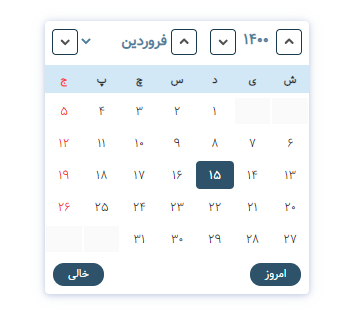
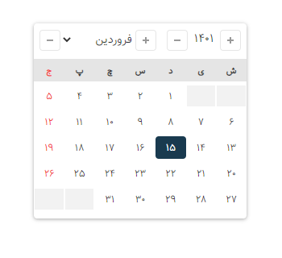

# JalaliDatePicker
[](https://www.npmjs.com/package/@majidh1/jalalidatepicker)


[](https://raw.githubusercontent.com/majidh1/JalaliDatePicker/main/LICENSE)

<div dir="rtl">
 





## نصب و استفاده
 1- با استفاده از npm یا فولدر dist در همین مخزن آخرین نسخه را دریافت کنید
 <br/>
 <div dir="ltr">
 &nbsp&nbsp&nbsp npm i @majidh1/jalalidatepicker
 <br/>&nbsp&nbsp &nbsp OR<br/>
 &nbsp&nbsp&nbsp https://github.com/majidh1/JalaliDatePicker => /dist/
 <br/>
 </div>
 2- دوفایل زیر را به پروژه اضافه کنید
  <br/><br/>
 <div dir="ltr">

```html
<link type="text/css" rel="stylesheet" href="jalalidatepicker.min.css" />
<script type="text/javascript" src="jalalidatepicker.min.js"></script>
```

 </div>
 3- به inputهای مورد نیاز Attribute زیر را  اضافه کنید.
 <br/>
&nbsp&nbsp &nbsp <b>data-jdp</b><br/>
 <div dir="ltr">

```html
<input data-jdp>
```

 </div>
 4- برای شروع کارکرد از تکه کد زیر استفاده کنید
 <div dir="ltr">

```javascript
jalaliDatepicker.startWatch();
```

 </div>

## تنظیمات

#### Info & Methods

بعد از لود فایل js یک object به نام jalaliDatepicker به صورت global  که شامل 3 متد زیر است.ایجاد می‌شود

 <div dir="ltr">

``` javascript
jalaliDatepicker.startWatch(options);
jalaliDatepicker.show(input);
jalaliDatepicker.hide();
```

 </div>
 
1. `startWatch(options)` شروع کار و پردازش روی input ها
2. `show(input)` نمایش روی یک input
3. `hide` مخفی شدن

### Options

key | default | description
----|---------|------------
`autoShow` | true | نمایش خودکار
`autoHide` | true | مخفی شدن خودکار
`separatorChar` | `"/"` | جداکننده بین سال، ماه و روز
`minDate` | null | مشخص کننده حداقل تاریخ. در صورتی که برابر با `today` باشد `روز جاری` است. در صورتی که برابر با `attr` باشد برابر با مقدار `data-jdp-min-date` attrubute  است
`maxDate` | null | مشخص کننده حداکثر تاریخ. در صورتی که برابر با `today` باشد `روز جاری` است. در صورتی که برابر با `attr` باشد برابر با مقدار `data-jdp-max-date` attrubute  است
`initDate` | null | تاریخی که به صورت پیشفرض نمایش داده می‌شود در صورتی که تنظیم نشود برابر است با `روز جاری`.
`plusHtml` | `"svg"` | html مربوط به دکمه افزایش سال و ماه
`minusHtml` | `"svg"` | html مربوط به دکمه کاهش سال و ماه
`container` | "body" | datepicker در کجا ساخته شود
`dpContainer` | null | Container مربوط به datepicker
`selector` | "input[data-jdp]" | selector مربوط به autoShow
`zIndex` | 1000 | zIndex مربوط به datepicker
`days` | ["ش", "ی", "د", "س", "چ", "پ", "ج"] | نام روزهای هفته
`months` | ["فروردین", "اردیبهشت", "خرداد", "تیر", "مرداد", "شهریور", "مهر", "آبان", "آذر", "دی", "بهمن", "اسفند"] | نام ماه‌های موجود
`changeMonthRotateYear` | false | با تغییر ماه سال نیز کم یا زیاد شود
`showTodayBtn` | true | نمایش دکمه امروز
`showEmptyBtn` | true | نمایش دکمه پاکسازی
</div>
